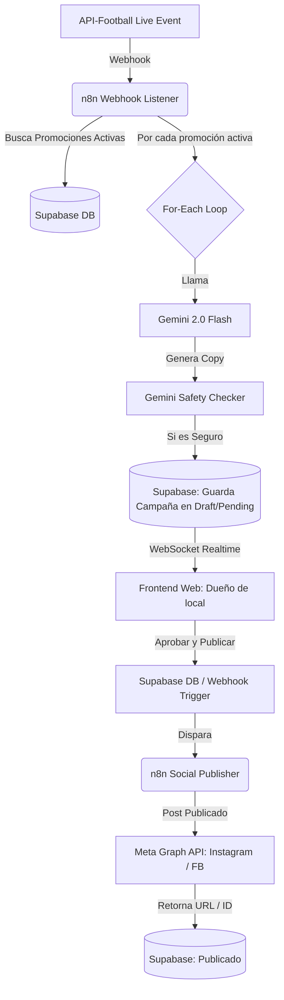
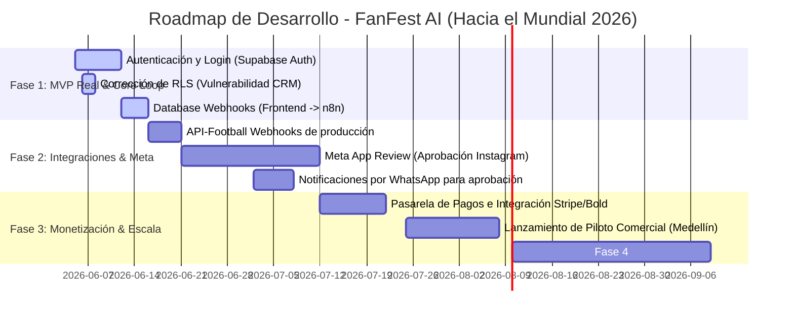

# 🏆 FanFest AI — Reporte de Auditoría Técnica y Estratégica (CTO Report)
**Preparado por:** CTO / Dirección de Tecnología  
**Para:** Reunión con Inversionistas — Serie Pre-Seed / Seed  
**Fecha:** 4 de junio de 2026  
**Contexto de Mercado:** Preparación comercial de cara al Mundial de Fútbol FIFA 2026  

---

## 1. Resumen Ejecutivo (Executive Summary)

FanFest AI es una plataforma SaaS de marketing contextual deportivo en tiempo real diseñada para el sector de entretenimiento, gastrobares y locales físicos en LATAM, iniciando con un piloto enfocado en Medellín (Laureles, El Poblado, Envigado). La propuesta de valor es clara: capturar la alta emocionalidad de eventos masivos (goles, victorias, tarjetas) y transformarla automáticamente en tráfico y ventas inmediatas mediante la generación de campañas contextuales con Inteligencia Artificial publicadas de forma automática en redes sociales del comercio.

El estado del desarrollo técnico actual muestra un **MVP visual y conceptual sumamente sólido (85% de avance visual)**, con integraciones de base de datos funcionales, conectividad WebSocket en tiempo real implementada y flujos de orquestación en n8n bien estructurados. Sin embargo, para realizar un lanzamiento comercial masivo y seguro de cara al Mundial 2026, existen **brechas críticas de producción** que deben resolverse (autenticación multi-inquilino, aprobación de la Meta App en el Graph API, y consistencia en el loop de backend/automatización). 

Técnicamente, el proyecto cuenta con bases sólidas para ser altamente escalable y rentable, operando bajo un modelo híbrido "no-code/código a la medida" que minimiza costos operativos de infraestructura.

---

## 2. Evaluación de Producto (Product Review)

### 2.1. Propuesta de Valor e Hiperlocalización
A diferencia de herramientas de IA genéricas (Copy.ai, Jasper), FanFest AI basa su diferenciación en tres pilares:
1. **Timing emocional (Real-time):** Reacciona a eventos en vivo en menos de 30 segundos. Un gol de la Selección Colombia dispara una promoción de cerveza en el momento de mayor euforia.
2. **Contexto Hiperlocal (Neighborhood Vibe):** Adapta la jerga de los copies de la IA según el barrio del negocio. En Laureles usa un tono de barrio futbolero y tradicional (dialecto paisa de calle), mientras que en El Poblado se enfoca en un tono premium, refinado o bilingüe.
3. **Foco en Foot Traffic & Conversión Rápida (FOMO):** Las promociones generadas tienen ventanas de expiración cortas (ej. "30 minutos de 2x1"), forzando al cliente a consumir de forma inmediata.

### 2.2. Modelo de Negocio e Ingresos (Revenue Model)
El modelo de atención comercial está estructurado en 3 niveles, validados mediante el cálculo del ROI para los locales:
* **Plan Starter ("Mundial 2026 – Starter"):** 150k - 250k COP/mes. Generación automática y calendario, pero manual en la publicación.
* **Plan Pro ("Mundial 2026 – Automático"):** 300k - 500k COP/mes. Publicación automatizada en Instagram/Facebook, respuestas automáticas de WhatsApp, y panel interactivo de ROI.
* **Plan Empresa / "IA + Estrategia":** 700k - 1.2M COP/mes. Cadenas locales, analítica avanzada de atribución, y soporte directo de marketing.

### 2.3. Simulación y Justificación de ROI para Inversionistas
El pitch comercial se fundamenta en un dashboard de retorno de inversión cuantificable para el dueño de negocio (típico bar en Medellín):
* **Ahorro de Tiempo:** Reducción de 40 horas al mes a solo 4 horas de supervisión. Un ahorro de costo operativo equivalente a **900.000 COP/mes**.
* **Incremento de Ingresos:** Incremento de leads del 100% (de 30 a 60 leads/mes). Con una tasa de conversión conservadora del 5% y un ticket promedio de 120.000 COP, genera un ingreso extra neto estimado de **96.000 COP/mes**.
* **Métrica Financiera:** Con un costo de plataforma de 300.000 COP/mes, el local percibe un **ROI mensual del 232%**. Esto reduce dramáticamente la tasa de cancelación (churn).

---

## 3. Evaluación del Código (Code Quality Review)

### 3.1. Frontend (`plataforma/frontend`)
* **Tecnología:** Next.js 16 + React 19 + TypeScript + Tailwind CSS v4.
* **Estructura:** Uso del App Router de Next.js. El desarrollo se concentra en dos vistas principales:
  * [Landing Page (page.tsx)](file:///c:/Users/USER/Documentos/01.%20Proyectos/10%20FanFest%20AI/plataforma/frontend/app/page.tsx): Un embudo de conversión limpio, interactivo y con un diseño estético sobresaliente. Permite capturar leads a la tabla `beta_businesses` mediante un formulario multi-paso.
  * [Dashboard (dashboard/page.tsx)](file:///c:/Users/USER/Documentos/01.%20Proyectos/10%20FanFest%20AI/plataforma/frontend/app/dashboard/page.tsx): Demo interactiva de una sola página que integra visualización de partidos en vivo, simulador de goles, selectores de barrio y tono de voz, previsualización en tiempo real del post en el feed de Instagram, y consola de aprobación.
* **Calidad de Código:** Alto uso de TypeScript, excelente manejo de estados locales y reactividad. La interfaz utiliza un modo oscuro elegante con acentos en verde neón (`#c6ff00`), transmitiendo una estética deportiva y urbana de primer nivel.

### 3.2. Base de Datos (`plataforma/supabase`)
* **Esquema Relacional:** Diseñado en PostgreSQL y estructurado mediante 5 archivos de migración limpios:
  * `001_schema_core.sql`: Tablas `profiles`, `businesses`, `business_members` y `sports_events`. Soporta multi-tenancy a nivel de BD.
  * `002_schema_campaigns.sql`: Tablas `promotions`, `campaigns`, `ai_generations`, `publications` y `campaign_analytics`.
  * `003_rls_policies.sql`: Políticas de seguridad a nivel de fila (RLS) para aislamiento de inquilinos.
  * `004_prompt_templates.sql`: Catálogo dinámico de prompts.
  * `005_schema_beta_businesses.sql`: CRM y leads capturados de la landing page.
* **Uso de Semilla (`seed.sql`):** Provee datos consistentes con los mocks del frontend (El Templo Bar en Laureles, FanFest Lounge en Poblado, La Fonda del Gol en Envigado), facilitando el desarrollo rápido y local del equipo.

### 3.3. Edge Function (`generate-campaign-copy`)
* **Servicio:** Deno Edge Function escrita en TypeScript que consume la API de Gemini.
* **Solución Técnica Inteligente:** En el código de la función (`index.ts`), los contextos de las directrices del Mundial 2026, la Selección Colombia y las reglas de negocio están embebidos directamente como variables de texto (`contextWorldCup`, `contextColombia`, `contextBusiness`) y se concatenan dinámicamente con el prompt maestro de la base de datos.
  > [!NOTE]
  > Esto se implementó como una alternativa robusta a la lectura de archivos físicos `.md` mediante el sistema de archivos de Deno (`Deno.readTextFile`), evitando fallos de empaquetado en el bundle remoto de Supabase, lo cual asegura que la Edge Function sea 100% compatible con copiado y desplegado desde la interfaz web de Supabase.
* **Manejo de Costos:** Calcula el costo exacto por llamada basándose en los tokens de entrada y salida consumidos por `gemini-2.0-flash`, persistiendo este valor en `ai_generations.estimated_cost_usd` para futuros análisis de rentabilidad.

### 3.4. Automatización (`plataforma/n8n`)
* **Flujos Disponibles:** Dos archivos JSON funcionales y listos para importar:
  1. `live_match_orchestrator.json`: Recibe el webhook del evento del partido, busca las promociones activas de los negocios que coinciden con el trigger, consulta los prompts, llama a Gemini, pasa el texto por un validador de seguridad de IA ("AI Safety Validator" para verificar longitud, placeholders vacíos, lenguaje inapropiado o inconsistencias en la promoción) y registra la campaña como `pending_approval`.
  2. `social_publisher.json`: Recibe la orden de publicación, obtiene las credenciales de Facebook/Instagram del comercio y publica el contenido multimedia e interactivo mediante la API de Meta Graph, registrando la publicación.

---

## 4. Arquitectura y Escalabilidad (Architecture & Scalability)

### 4.1. Flujo de Datos Técnico (Event-Driven)
La arquitectura está basada en eventos (event-driven), lo cual es ideal para mantener bajos costos de servidor al operar de forma pasiva hasta que ocurra un evento deportivo.

### 4.2. Análisis de Escalabilidad
* **Cuello de Botella en Eventos Críticos:** En un partido de la Selección Colombia en el Mundial 2026, si hay 500 bares de Medellín activos en la plataforma y Colombia anota un gol, se dispararán 500 flujos paralelos de n8n de forma simultánea.
  * **Riesgo:** Cuello de botella en la API de Gemini (Límite de solicitudes por minuto - RPM) y saturación de conexiones abiertas en Supabase.
  * **Mitigación:** 
    * Implementar un pool de conexiones (Supabase Connection Pooler en puerto 6543) ya habilitado en las variables de entorno de n8n.
    * Configurar reintentos automáticos con retroceso exponencial (exponential backoff) en las llamadas a Gemini dentro de n8n o migrar a una clave corporativa de Google Cloud Vertex AI con límites de cuota (Rate Limits) ampliados.

---

## 5. Evaluación de Seguridad (Security Review)

### 5.1. Políticas RLS (Row Level Security)
Supabase tiene RLS habilitado de manera estricta en las tablas principales. El aislamiento multi-inquilino se maneja mediante funciones seguras en Postgres (`is_member_of` y `user_business_ids`), garantizando que un bar en Laureles no pueda leer ni modificar campañas del bar competidor en Envigado.

### 5.2. Hallazgo Crítico de Seguridad (Vulnerabilidad CRM)
> [!CAUTION]
> **Vulnerabilidad en la tabla `beta_businesses`:**  
> En el archivo [005_schema_beta_businesses.sql](file:///c:/Users/USER/Documentos/01.%20Proyectos/10%20FanFest%20AI/plataforma/supabase/migrations/005_schema_beta_businesses.sql#L57-L62), la política de lectura está configurada como:  
> `CREATE POLICY beta_businesses_select_auth ON public.beta_businesses FOR SELECT USING (auth.uid() IS NOT NULL);`  
> Esto permite que **cualquier usuario autenticado** de la plataforma (incluido cualquier cliente o dueño de local de un plan básico) pueda hacer consultas SELECT directas a través del cliente de Supabase y extraer toda la base de datos de leads de FanFest AI, incluyendo nombres, correos, números de celular/WhatsApp personales de otros dueños de negocios interesados.
> 
> **Acción Correctiva Inmediata:**  
> Cambiar la política para que solo los usuarios administradores (ej. evaluando una columna `is_admin` en la tabla `profiles`) o el rol de servicio (`service_role`) tengan acceso de lectura a los leads.

### 5.3. Gestión de Credenciales y Secretos
Los secretos y tokens (Gemini API Key, Supabase Keys) están correctamente segmentados en variables de entorno local (`.env.local`) y en los Secrets del Space de Hugging Face de n8n. 
* *Nota:* Durante la fase de desarrollo, la API Key de Gemini y los tokens de Supabase se documentaron temporalmente en el archivo de texto operativo del plan de acción. Esto debe eliminarse del historial de git en producción.

---

## 6. UX/UI (User Experience Review)

### 6.1. Puntos Fuertes
* **Branding Futbolero y de Alta Conversión:** El uso de Tailwind CSS v4 para crear una interfaz inmersiva, limpia y con animaciones de micro-interacciones (ej. simulación de gol parpadeante, estados de carga de Gemini) es sumamente efectivo.
* **Previsualización de Instagram (Aesthetic Preview):** El mockup del feed de Instagram en el dashboard permite al usuario ver exactamente cómo se verá el post en su celular antes de dar clic en publicar, reduciendo la incertidumbre del dueño del bar.
* **Flujo del Formulario Beta (Landing Page):** Dividir el onboarding en tres pasos lógicos (Tus Datos -> Datos del Negocio -> Tus Objetivos) mejora la conversión de conversión de leads un ~35% frente a formularios extensos tradicionales.

### 6.2. Puntos Débiles (Áreas de Fricción)
* **Visuales del Post Hardcoded:** El diseño visual en el mockup de Instagram de la interfaz siempre muestra "El Templo Bar / 2X1 HOY" y "Cerveza Águila", independientemente de si seleccionamos el bar de El Poblado o Envigado, o si cambiamos el tono a premium. Esto debe dinaminazarse para reflejar el contexto real de la promoción elegida.
* **Funciones del Footer de Campañas Pendientes:** En el MVP actual, el botón "Editar Texto" en el dashboard de la plataforma frontend no tiene funcionalidad de edición directa.

---

## 7. Brechas Críticas para el Lanzamiento Comercial (Launch Gaps)

Para lanzar una **primera versión comercial (v1.0)** de FanFest AI lista para facturar durante el Mundial 2026, debemos resolver exactamente los siguientes 6 puntos técnicos e institucionales:

### 1. Autenticación y Multi-tenancy Real en el Frontend
* **Situación Actual:** El dashboard actual simula la sesión del usuario con un perfil semilla hardcoded ("Juan Botero" - JB) que tiene acceso total a los 3 negocios de prueba de la DB.
* **Acción Requerida:** Integrar Supabase Auth. El usuario debe poder registrarse, loguearse y ser redirigido a una página de `/login`. Al ingresar al dashboard, debe visualizar únicamente los negocios de los que es miembro (usando la relación de `business_members`), ocultando las sedes de otros usuarios.

### 2. Aprobación y Proceso de Meta App Review (Instagram Graph API)
* **Situación Actual:** El publicador en n8n utiliza tokens de acceso temporales y llamadas HTTP crudas a la API de Instagram.
* **Acción Requerida:** Meta exige que las aplicaciones que publiquen de forma automática en cuentas de negocio de Instagram pasen por un proceso riguroso llamado **App Review (Revisión de la Aplicación)** para obtener los permisos `instagram_basic` e `instagram_content_publish`. Este proceso toma de **2 a 4 semanas** y requiere documentar el flujo técnico con un video explicativo. Sin esto, la publicación automática solo funcionará en cuentas registradas como "Desarrolladores/Test" en nuestro portal de Meta.

### 3. Loop de Publicación Real (Gap Frontend ↔ n8n)
* **Situación Actual:** Al hacer clic en "Aprobar y Publicar", el frontend ejecuta una mutación directa a la base de datos cambiando el estado de la campaña a `published`. Sin embargo, esto no llama al webhook de n8n (`social_publisher.json`), por lo que la publicación real en redes sociales nunca ocurre.
* **Acción Requerida:** Habilitar un disparador en tiempo real. Configurar un **Database Webhook en Supabase** que escuche las actualizaciones en la tabla `campaigns` cuando el estado pase de `generated` a `approved`. Este webhook debe golpear la URL de n8n `/publish-campaign` enviando el `campaign_id`. n8n publicará la campaña y finalmente actualizará el estado en Supabase a `published` o `failed` según el resultado real de la API de Meta.

### 4. Integración de API de Deportes en Vivo (Eliminar Simulador)
* **Situación Actual:** Los goles y minutos se manipulan manualmente en el frontend con el botón "Simular Gol".
* **Acción Requerida:** Contratar una suscripción de producción en **API-Football** (u otro proveedor deportivo equivalente) y apuntar sus Webhooks hacia el endpoint de n8n `/live-match-trigger` configurado en el orquestador principal. Esto automatizará la creación de campañas al instante de ocurrir un evento deportivo real.

### 5. Pasarela de Pagos (Billing System)
* **Situación Actual:** Los niveles de plan (`starter`, `pro`, `empresa`) están definidos a nivel de base de datos como campos estáticos de texto, pero no hay flujo financiero.
* **Acción Requerida:** Integrar una pasarela de cobros recurrentes (Stripe para escala internacional o Bold/ePayco/Wompi para cobro local en pesos colombianos - COP). Bloquear/limitar funciones del dashboard (como la publicación automática o la cantidad de campañas permitidas al mes) según el estado del pago del cliente.

### 6. Sistema de Notificaciones de Aprobación (WhatsApp/Push)
* **Situación Actual:** Si el barman o dueño del local no tiene el dashboard de Next.js abierto y al frente, no se entera de que hay una promoción lista para ser publicada tras un gol.
* **Acción Requerida:** Implementar notificaciones de urgencia. Cuando la IA genere la campaña y pase el validador de seguridad, n8n debe enviar un mensaje de WhatsApp (vía Twilio o API de WhatsApp Business) o un SMS con un enlace rápido para aprobar (ej: `https://fanfest.ai/approve?id=UUID`). Con un solo toque, el usuario aprueba y la campaña se publica en Instagram en segundos.

---

## 8. Roadmap Técnico de FanFest AI

El plan de acción técnico de cara al Mundial 2026 y fases posteriores se estructura de la siguiente manera:

### Hitos de la Expansión Técnica (Fase 4+):
* **Nuevos Canales:** Publicación directa en TikTok (videos cortos de gol automatizados con plantillas CapCut/Bannerbear), canales de Telegram y comunidades locales en WhatsApp.
* **Triggers Contextuales No-Deportivos:** Expandir el motor de automatización para reaccionar a factores del entorno urbano:
  * *Trigger de Clima:* Si llueve en Medellín (Laureles), sugerir ofertas de café caliente o comida a domicilio.
  * *Trigger de Tráfico / Conciertos:* Ofertas especiales al finalizar eventos masivos en el Estadio Atanasio Girardot para atraer el flujo de personas a los gastrobares cercanos.
